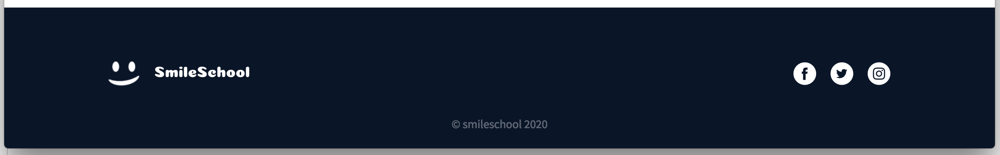

# holberton-smiling-school

*In this project, you will implement 3 web pages with Bootstrap. You will use all HTML/CSS/Accessibility/Responsive design/Bootstrap knowledges*

**Note:** This webpage has been designed by Nicolas Philippot, UI/UX designer.

Here the final result:

### Web page: Homepage

**:desktop_computer: Desktop version**

    

**:iphone: Mobile version**

    

### Web page: Pricing

**:desktop_computer: Desktop version**

    

**:iphone: Mobile version**

    

### Web page: Courses

**:desktop_computer: Desktop version**

    

**:iphone: Mobile version**

    

 

## Requirements

- You have to use Bootstrap
- Your [styles.css](styles.css) must be as small as you can - you must use as much as you can Bootstrap classes.

 

## Tasks

**:bulb: [0. Read and be familiar with Figma](README.md)**

Important notes with Figma:

- if your computer doesn’t have missing fonts, you can find them here: source-sans-pro and Spin-Cycle-OT
- some values are in float - feel free to round them
- “Be pixel perfect” - yes! but mainly make sure colors, size and position are correct. #C271FF is not purple.

**Interactions note:**

- Web pages must switch to the tablet version when the screen width is 768px
- Web pages must switch to the mobile version when the screen width is 576px
- button hover/active: opacity: 0.9

 

**:bulb: [1. Header first](0-homepage.html)**

Let’s start by the Homepage: create the header/hero piece.

**Desktop:**

**Mobile:**

 

**:bulb: [2. Carousel of quotes](1-homepage.html)**

Create the section “Carousel of quotes”

By using a Carousel component of Bootstrap, create this Carousel of quotes.

You can have for the moment one quote or twice the same for testing (like example below)

 

**:bulb: [3. Popular videos](2-homepage.html)**

Create the section “Most popular tutorials”

By using a Carousel component of Bootstrap, create this Carousel of video cards.

Reminder:

- Desktop: 4 cards
- Tablet: 2 cards
- Mobile: 1 card

 

**:bulb: [4. Row of smiles](3-homepage.html)**

Create the section “Free membership”.

 

**:bulb: [5. Latest videos](4-homepage.html)**

Create the section “Latest videos”

Copy the block “Most popular tutorials” to “Latest videos”

 

**:bulb: [6. ... and the footer!](homepage.html)**

Create the footer

 

**:bulb: [7. Pricing - header](0-pricing.html)**

Now, let’s do the pricing page: create the header/hero piece

The mobile version must be the same as the Homepage - it’s time to reuse code!

**Desktop:**

 